<p align="center">
  
</p>

```console
$ ros2 launch hcdiekmann bringup.launch.py
[INFO] role ............ Software Engineer · Forward Deployed Engineer
[INFO] origin .......... 🇳🇦 Namibia → 🇩🇪 Germany → 🇳🇱 Netherlands → 🇨🇭 Zürich
[INFO] operating range . robots & IoT ─► services ─► platform ─► operator
[INFO] sweet spot ...... where software meets the physical world
[WARN] requirements not fully defined — good. proceeding.
[ OK ] ready for deployment
```

### ▸ Mission profile

```diff
- "Implement this CRUD endpoint."
+ "There are 500 robots and thousands of sensors in the field. Operators need to
+  know what they're doing, customers need to see results, and it can't stop
+  working when the internet disappears."
```

I embed with the teams who operate the system — scoping on-site, translating operational needs into architecture, and owning delivery through to production in the field. Success is measured at the customer, not at the merge.

### ▸ Subsystems

| | |
|---|---|
| 🤖 **Robotics & IoT** | ROS 2 · fleet management · IoT sensors & actuators · telemetry · computer vision · simulation |
| ⚙️ **Backend & distributed** | Python · TypeScript · FastAPI · Next.js · PostgreSQL · RabbitMQ · MQTT · WebSockets |
| ☁️ **Infra & deployment** | Docker · Kubernetes · AWS · GitLab CI/CD · Ansible · observability · on-prem / edge |
| 🖥️ **Operator interfaces** | real-time dashboards · maps & geospatial · web push & notifications · PWAs |

### ▸ Current mission

🌱 **Autonomous laser-weeding rovers** — tech lead / architect of the fleet platform: real-time telemetry, fleet state, geospatial UIs, session orchestration, auth, reporting, and the Kubernetes infra behind it.  
<sub>`Next.js` `FastAPI` `RabbitMQ` `Kubernetes` `InfluxDB` `PostgreSQL` `MapLibre`</sub>
